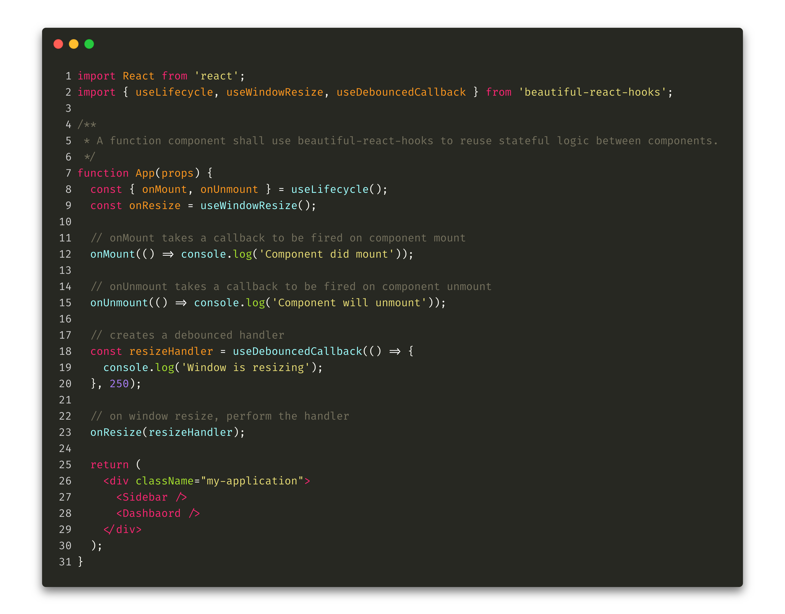

<div align="center">
  <p align="center">
    
  </p>
  <p align="center">
    A collection of beautiful (and hopefully useful) React hooks to speed-up your 
    components development
  </p>
</div>




## Features

* Concise API
* Small and lightweight

## Why?


## Install

```js 
$ npm install beautiful-react-hooks
```

or

```js 
$ yarn add beautiful-react-hooks
```

## Hooks

* [useCallbackRef](./docs/useCallbackRef.md)
* [useOnMount](./docs/useOnMount.md)
* [useWillUnmount](./docs/useWillUnmount.md)
* [useLifecycle](./docs/useLifecycle.md)
* [useWindowResize](./docs/useWindowResize.md)
* [useDebouncedCallback](./docs/useDebouncedCallback.md)
* [useMouse](./docs/useMouse.md)
* [useMouseState](./docs/useMouseState.md)
* [useMouseHandler](./docs/useMouseHandler.md)


<hr />

<small> logo has been created by stealing from [FreePik](https://www.freepik.com/free-photos-vectors/design)</small>
