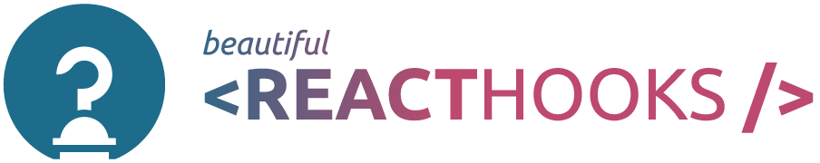
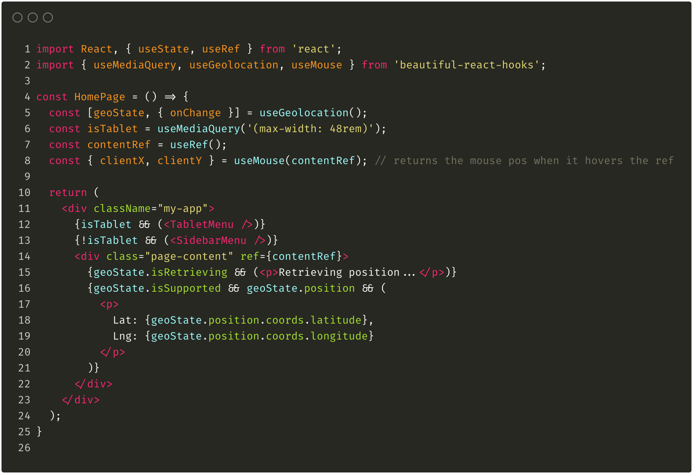

[](https://coveralls.io/github/beautifulinteractions/beautiful-react-hooks?branch=master)[](https://opensource.org/licenses/MIT)


<div align="center">
  <p align="center">
    
  </p>
</div>
<br />
<div>
  <p align="center">
    可以显著为你提升组件开发和 hooks 开发效率的一系列漂亮（说不定也是才貌双全）的 React hooks。
  </p>
</div>

<div>
  <p align="center">
    <a href="https://antonioru.github.io/beautiful-react-hooks/" target="_blank">
    🌟 在线演示 🌟
    </a>
  </p>
</div>



<a href="https://github.com/beautifulinteractions/beautiful-react-hooks/">🇬🇧 English</a> | 🇨🇳 简体中文
| <a href="https://github.com/beautifulinteractions/beautiful-react-hooks/blob/master/docs/README.it-IT.md">🇮🇹 Italiano</a>
| <a href="https://github.com/beautifulinteractions/beautiful-react-hooks/blob/master/docs/README.es-ES.md"> 🇪🇸 Español </a>
| <a href="https://github.com/beautifulinteractions/beautiful-react-hooks/blob/master/docs/README.uk-UA.md">🇺🇦 Ukrainian</a>
| <a href="https://github.com/beautifulinteractions/beautiful-react-hooks/blob/master/docs/README.pt-BR.md">🇧🇷 Brazilian Portuguese</a>
| <a href="https://github.com/beautifulinteractions/beautiful-react-hooks/blob/master/docs/README.pl-PL.md">🇵🇱 Polski </a>
| <a href="https://github.com/beautifulinteractions/beautiful-react-hooks/blob/master/docs/README.jp-JP.md">&#x1f1ef;&#x1f1f5; 日本語 </a>

## 💡 为什么?

React hooks 让我们能把组件的业务逻辑抽象到一个可重用的函数里。<br />
根据到目前为止的使用经验，我们发现：我们创建并在内部项目之间复用的大多数 hooks 通常都有一些共同的写法，涉及回调引用、事件或是组件生命周期。<br />
发现这一点后，我们尝试把这些常用的写法抽出来放进 `beautiful-react-hooks` —— 一系列 _（说不定）_ 有用的 React hooks —— 来帮助其他公司和专家们加速他们的开发。<br /><br />
此外，我们创建了简明而稳固的 API，时刻牢记代码可阅读性，专注于保持学习曲线越低越好，以便它们可以被更大的团队分享和使用。

**-- 请在使用任何 hook 之前读完它的文档！ --**

## ☕️ 功能

- 简明的 API
- 小巧轻量
- 易于学习

<div>
  <p align="center">
    <a href="https://antonioru.github.io/beautiful-react-hooks/" target="_blank">
    🌟 在线演示 🌟
    </a>
  </p>
</div>

## 🕺 安装

使用 `npm`:

```bash
$ npm install beautiful-react-hooks
```

使用 `yarn`:

```bash
$ yarn add beautiful-react-hooks
```

## 🎨 Hooks

* [useQueryParam](useQueryParam.md)
* [useQueryParams](useQueryParams.md)
* [useSearchQuery](useSearchQuery.md)
* [useURLSearchParams](useURLSearchParams.md)
* [useInfiniteScroll](useInfiniteScroll.md)
* [useObservable](useObservable.md)
* [useEvent](useEvent.md)
* [useGlobalEvent](useGlobalEvent.md)
* [usePreviousValue](usePreviousValue.md)
* [useValueHistory](useValueHistory.md)
* [useValidatedState](useValidatedState.md)
* [useMediaQuery](useMediaQuery.md)
* [useOnlineState](useOnlineState.md)
* [useViewportSpy](useViewportSpy.md)
* [useViewportState](useViewportState.md)
* [useSpeechSynthesis](useSpeechSynthesis.md) and [useSystemVoices](useSystemVoices.md)
* [useGeolocation](useGeolocation.md), [useGeolocationState](useGeolocationState.md) and [useGeolocationEvents](useGeolocationEvents.md)
* [useDrag](useDrag.md), [useDropZone](useDropZone.md) and [useDragEvents](useDragEvents.md)
* [useMouse](useMouse.md), [useMouseState](useMouseState.md) and [useMouseEvents](useMouseEvents.md)
* [useTouch](useTouch.md), [useTouchState](useTouchState.md) and [useTouchEvents](useTouchEvents.md)
* [useLifecycle](useLifecycle.md), [useDidMount](useDidMount.md) and [useWillUnmount](useWillUnmount.md)
* [useWindowResize](useWindowResize.md)
* [useWindowScroll](useWindowScroll.md)
* [useRequestAnimationFrame](useRequestAnimationFrame.md)
* [useResizeObserver](useResizeObserver.md)
* [useTimeout](useTimeout.md)
* [useInterval](useInterval.md)
* [useDebouncedCallback](useDebouncedCallback.md)
* [useThrottledCallback](useThrottledCallback.md)
* [useLocalStorage](useLocalStorage.md)
* [useSessionStorage](useSessionStorage.md)
* [useDefaultedState](useDefaultedState.md)
* [useRenderInfo](useRenderInfo.md)
* [useSwipe](useSwipe.md), [useHorizontalSwipe](useHorizontalSwipe.md) and [useVerticalSwipe](useVerticalSwipe.md)
* [useSwipeEvents](useSwipeEvents.md)
* [useConditionalTimeout](useConditionalTimeout.md)

<div>
  <p align="center">
    <a href="https://antonioru.github.io/beautiful-react-hooks/" target="_blank">
    🌟 在线演示 🌟
    </a>
  </p>
</div>

## 如何贡献

我们非常欢迎而且期待着你的开源贡献。

如果想要提交你的自定义 hook，请确保你阅读过这篇 [贡献](../CONTRIBUTING.md) 守则。

在提交一个合并请求 **之前**，请确保:

1. 你已经更新了 package.json 里的版本号，并将你的变更说明放进了 [CHANGELOG](../CHANGELOG.md) 文件里。
2. 确保你执行过 `npm test` 和 `npm build` 再提交你的合并请求。
3. 确保你已经写好了你添加的自定义 hook 的文档 _（你可以使用[HOOK 文档模板](../HOOK_DOCUMENTATION_TEMPLATE.md) 来写你的文档 ）_
4. 确保你已经更新了 `index.d.ts` 文件，把你的 hook 的类型加进去了。

### 项目依赖

- [React](https://reactjs.org/)
- [Mocha](https://mochajs.org/)
- [Chai](https://www.chaijs.com/)
- [@testing-library/react](https://testing-library.com/docs/react-testing-library/intro)
- [@testing-library/react-hooks](https://react-hooks-testing-library.com/)

---

图标的作者是 [Freepik](https://www.flaticon.com/authors/freepik) from [www.flaticon.com](https://www.flaticon.com/free-icon/hook_1081812)
